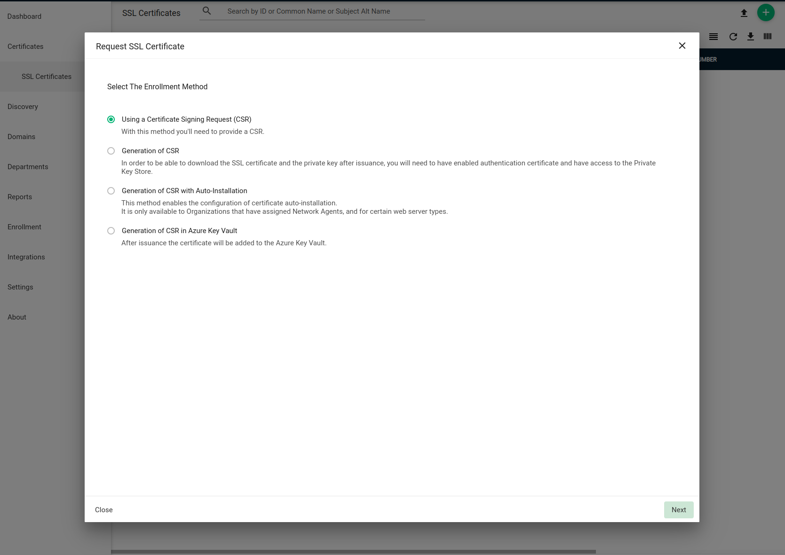

## SSL Certificates

SSL certificates are a small data files that cryptographically establish an encrypted link between a web server and a browser. SSL certificates help protect user data by keeping it private and ensuring that this information is passed securely between the web server and browser using the encrypted link. By using SSL certificates on your website, you can prevent hackers from intercepting a user's private information after it has been submitted to the server. SSL certificates are considered a security requirement for most modern websites. As such, the University Technology Services (UTS) at McMaster requires web applications that want to use SSO to have SSL certificates as well. 

Before registering your SPA on the Microsoft Azure Directory, you will need to request SSL certificates from UTS. This section of the learning module will guide you through the process of generating the required files to request SSL certificates and setting up those certificates on your dockerized Next.js application. 

### Create CSR with OpenSSL

A Certificate Signing Request, CSR, is a file you obtain to request an SSL certificate from a Certificate Authority.

To generate the CSR with OpenSSL, you must first generate a private RSA key using the following command:  

```bash
openssl> genrsa -des3 -out server.key 2048
```

The key should be at least a 2048-bit RSA key and must be encrypted using either Triple-DES or any other applicable method and must be stored in a PEM format so that it is readable as ASCII text.

Once the private key is ready, a Certificate Signing Request (CSR) can be generated using the following command:  

```bash
openssl> req -new -key server.key -out server.csr
```

You will be prompted to enter your organization information and one critical attribute, common name. The common name is the fully qualified domain name (FQDN) of your server.

### Submit CSR to Certificate Authority

#### Create a Support Ticket With UTS

Once you have the CSR file ready, you can start a support ticket with UTS using the [Technology Services Jira Portal](https://macservicedesk.mcmaster.ca/plugins/servlet/desk/portal/742). Click on "Submit an IT Request" and fill out the form. Make sure to mention that you are requesting a certificate for your website and that you already generated the CSR file. Remember to attach the CSR file to the ticket before submitting it. 

#### Submit Certificate Request Using Sectigo Console

Assuming you have the permission and credentials for managing certificates using the Sectigo Console, sign onto Sectigo Console and select the SSL Certificates section. Click the green “add+” button. You will then be prompted to select an enrolment method.  

  

Select “Using a Certificate Signing Request (CSR)” and continue. Fill in the required details,  

- Organization
    - McMaster University
- Department
- Certificate Profile
    - Comodo EV Multi-Domain SSL Certificate or EliteSSL Certificate 
- Certificate Term

If you want to add extra common names to the certificate request, you must select the “EV Multidomain SSL” type. This option will give you the choice of adding extra common names if applicable. Otherwise, the type should remain as “Elite SSL Certificate” in most cases.  

Next, upload the CSR file. After the CSR is uploaded, review the content embedded in the CSR file is correct and the next screen will show the “auto-renewal” options. Check the auto renewal box if you want this certificate to be automatically renewed at the expiration date. Also, select the number of days prior to expiry that can be used to calculate the exact time of renewal for the certificate.  

Finally, accept the EULA terms and conditions to complete the request process. This will put the certificate in the queue waiting for approval. For more detail, please visit [McMaster Information Security website](https://informationsecurity.mcmaster.ca/certificate-request-process-for-sectigo-console-users/).  

### Using the SSL Certificates

When your SSL certificates are ready, you will receive an email from Sectigo with links to download these certificates in various formats. We recommend using the "Certificate (w/ issuer after), PEM encoded" format.  

The SSL certificate, private key you used to generate the CSR and the passphrase you assigned for the private key are be placed in `/etc/ssl/certs/`, `/etc/ssl/private/` and `/etc/ssl/` respectively. The files should be readable and writable by root user only. You may set the permission for the files using the command below.  

```bash
chmod 600 <filename>
```
