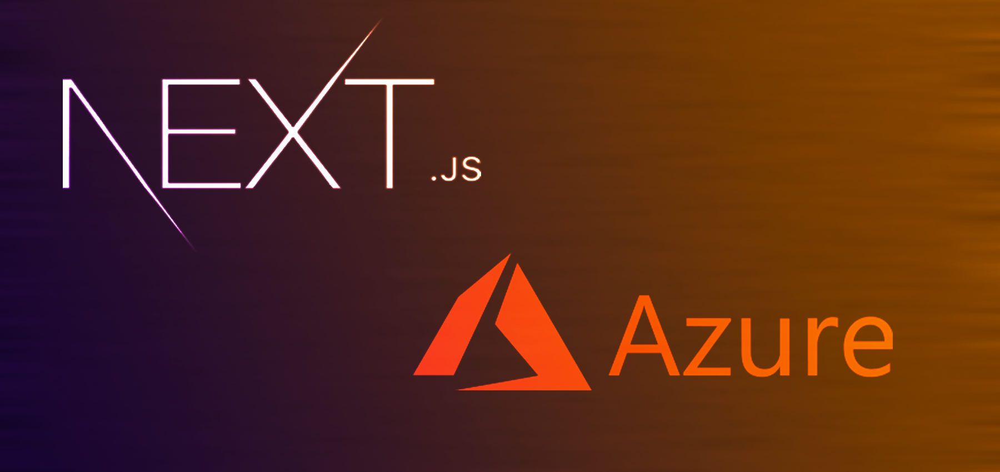

# Introduction to Single Sign-On (SSO)

_Image retrieved from [medium.com](https://medium.com/codex/running-next-js-on-azure-app-services-84f707af761d)

Modern websites often require an authentication solution to store user information and limit access to certain features and resources. Developing such a solution from scratch involves a lot of time and resources in addition to the numerous challenges such as handling security and data storage.

Luckily, there are existing solutions that help developers with the authentication process such as the Microsoft Azure Directory (AD) single sign-on. Single sign-on (SSO) is an authentication method that allows users to sign in using one set of credentials to multiple independent software systems. Using SSO means users will not have to create new credentials for every application they use. With SSO, users can access all needed applications with a single account, which reduces the risk of users using repeated passwords while saving them the hassle of creating and remembering a new pair of credentials. Microsoft Azure relies on the IDC (OpenID Connect) and OAuth 2.0 industry standard protocols to support authentication and authorization into various application. McMaster University uses SSO to provide authentication and authorization services using MacIDs for its web applications. The University Technology Services (UTS) manage the McMaster Azure Directory and assist developers with setting up new applications for SSO. 

In this workshop, we will learn how developers can make use of the Microsoft Azure Active Directory and the Microsoft Authentication Library for React (`msal-react`) to enable single sign-on using MacIDs in a dockerized Next.js application. We will also cover requesting SSL certificates for your application from UTS. No previous experience with the Azure AD is required. Familiarity with TypeScript, React, Next.js., Docker and Nginx will be helpful.

### Prerequisites 
- A server to host your SPA
- A dockerized Next.js application with a production image. You can follow the [Docker Tutorial](https://mcmasterrs.github.io/docker-tutorial) to familiarize yourself with Docker and create a dockerized Next.js application

