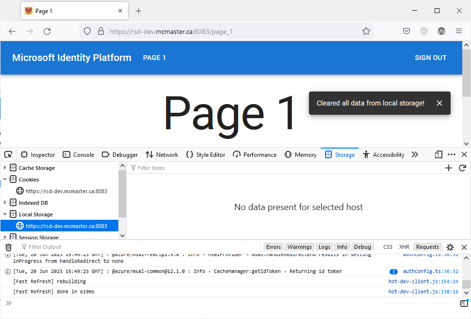

# Securely Storing Data in Local Storage in a Next.js SPA

Local storage is a type of client-side web storage that allows web applications to store data locally within the user’s browser. This web API enables developers to store key-value pairs in the browser’s memory without an expiration date. Developers often employ this tool to persist data across browser sessions and page refreshes. Local storage can be useful for storing user preferences (language, theme, etc.) or session data.  

Storing sensitive user information to the browser's local storage is often discouraged because it can be easily accessed by malicious scripts. User information should always be stored on the server side where it benefits from added security measures. Nevertheless, it is always a good idea to encrypt any information that you store in the local storage especially if you suspect that it can be used for malicious attacks.

## The `react-secure-storage` library

The [`react-secure-storage`](https://www.npmjs.com/package/react-secure-storage) library uses a combination of AES-256 encryption for securing data stored in the browser's local storage. This library generates a secure key for every browser and encrypt the data using this key, which means only the browser which encrypted the data can decrypt it. This added security measure will prevent hackers from using any data that they acquired from a user's local storage.  

1. **Installing the library**

To use the `react-secure-storage` library, add it to your project by navigating to the `client` directory in a terminal window and running the following command:  

```bash
npm install react-secure-storage
```

2. **Add `Snackbar` component**

Add the following import statements to `app/page_1/page.tsx`:  

```ts
import Button from "@mui/material/Button";
import {Stack} from "@mui/system";
import React from "react";
import secureLocalStorage from "react-secure-storage";
import IconButton from '@mui/material/IconButton';
import CloseIcon from '@mui/icons-material/Close';
import Snackbar from '@mui/material/Snackbar';
import TextField from '@mui/material/TextField';
```

Declare the following interface before the `Page_1()` function:  

```ts
export interface SnackbarMessage {
    message: string;
    key: number;
}
```

Add the following boilerplate code inside the `Page_1()` function (before the return statement). This code snippet allows you to display notifications using the `Snackbar` component to the top right corner of the application:  

```ts
const [snackPack, setSnackPack] = React.useState<readonly SnackbarMessage[]>([]);
const [open, setOpen] = React.useState(false);
const [messageInfo, setMessageInfo] = React.useState<SnackbarMessage | undefined>(
	undefined,
);

React.useEffect(() => {
	if (snackPack.length && !messageInfo) {
		// Set a new snack when we don't have an active one
		setMessageInfo({ ...snackPack[0] });
		setSnackPack((prev) => prev.slice(1));
		setOpen(true);
	} else if (snackPack.length && messageInfo && open) {
		// Close an active snack when a new one is added
		setOpen(false);
	}
}, [snackPack, messageInfo, open]);

const handleClose = (event: React.SyntheticEvent | Event, reason?: string) => {
	if (reason === 'clickaway') {
		return;
	}
	setOpen(false);
};

const handleExited = () => {
	setMessageInfo(undefined);
};

const action = (
	<React.Fragment>
		<IconButton
			size="small"
			aria-label="close"
			color="inherit"
			onClick={handleClose}
>
			<CloseIcon fontSize="small" />
		</IconButton>
	</React.Fragment>
);

const [secureVar, setSecureVar] = React.useState('');
const [insecureVar, setInsecureVar] = React.useState('');
```

Replace the code inside the `PermissionGate` component with the following snippet:  

```ts

 <>
	<Snackbar
		sx={{paddingTop: 10}}
		open={open}
		autoHideDuration={2000}
		onClose={handleClose}
		TransitionProps={{ onExited: handleExited }}
		message={messageInfo ? messageInfo.message : undefined}
		action={action}
		anchorOrigin={{vertical: 'top', horizontal: 'right'}}
	/>
	<Box
		display="flex"
		justifyContent="center"
		alignItems="center">
		<Typography variant="h1">Page 1</Typography>
	</Box>
	<Stack justifyContent="center" marginTop={5}direction="row" spacing={3}>
		<TextField id="secure_var" label="Secure Variable" variant="outlined" onChange={(
			event: React.ChangeEvent<HTMLInputElement | HTMLTextAreaElement>
		) => {
			setSecureVar(
				event.target
					.value as string
			)
		}}/>
		<TextField id="insecure_var" label="Insecure Variable" variant="outlined" onChange={(
			event: React.ChangeEvent<HTMLInputElement | HTMLTextAreaElement>
		) => {
			setInsecureVar(
				event.target
					.value as string
			)
		}}/>
	</Stack>
	<Stack justifyContent="center" marginTop={5} direction="row" spacing={2}>
		<Button variant="contained" onClick={handleStore}> Store Data </Button>
		<Button variant="contained" onClick={handleRetrieve}> Retrieve Data </Button>
		<Button variant="contained" onClick={handleDelete}> Delete Secure Varibale </Button>
		<Button variant="contained" onClick={handleClear}> Clear Data </Button>
	</Stack>
</>

```

We added four buttons to "Page 1" that will be used showcase the different functionalities offered by the `react-secure-storage` library along with two `TextField` components that we will be used to save an encrypted secure variable to the local storage and an insecure one.  

3. **Storing data**

To demonstrate storing data securely in the local storage, we will create a `handleStore` function that creates two key-value pairs (`secure_var` and `insecure_var`) and stores them in the browser's local storage. We will make use of the `setItem()` method provided by `secureLocalStorage` to encrypt and store `secure_var`, whereas `insecure_var` is stored using the regular `localStorage.setItem()` method that does not encrypt its value.  

Add the following function declaration inside the `Page_1()` function:  

```ts
const handleStore = () => {
	let message = "Data stored in local storage!"
	secureLocalStorage.setItem('secure_var', secureVar);
	localStorage.setItem('insecure_var', insecureVar);
	setSnackPack((prev) => [...prev, { message, key: new Date().getTime() }]);
}
```

4. **Retrieving data**

The `handleRetrieve` function will grab the values of `secure_var` and `insecure_var` (if they exist) from the local storage using the `getItem()` methods provided by `secureLocalStorage` and `localStorage` and display them in a notification in the top right corner of the screen.

Add the following function declaration inside the `Page_1()` function:  

```ts
const handleRetrieve = () => {
	let secure_var = secureLocalStorage.getItem("secure_var") ?? '';
	let insecure_var = localStorage.getItem("insecure_var") ?? '';
	let message = secure_var || insecure_var ? `Secure Variable: ${secure_var} - Insecure Variable: ${insecure_var}` : 'No data found in local storage!';
	setSnackPack((prev) => [...prev, { message, key: new Date().getTime() }]);
}
```

5. **Deleting an encrypted local storage key-value pair**

We will now add the `handleDelete` function that deletes `secure_var` from the local storage if it is found using the `removeItem()` method provided by `secureLocalStorage`.

Add the following function declaration inside the `Page_1()` function:  

```ts
const handleDelete = () => {
	let message = "Secure variable not found in local storage!";
	if (secureLocalStorage.getItem("var1") && secureLocalStorage.getItem("var2")) {
		message = "Secure variable deleted from local storage!";
		secureLocalStorage.removeItem("secure_var");
	}
	setSnackPack((prev) => [...prev, { message, key: new Date().getTime() }]);
}
```

6. **Clearing the local storage:**

Finally, we will add a `handleClear` function that deletes all saved data from the local storage using the `clear()` method provided by `secureLocalStorage`:  

``` ts
const handleClear = () => {
	secureLocalStorage.clear();
	let message = "Cleared all data from local storage!";
	setSnackPack((prev) => [...prev, { message, key: new Date().getTime() }]);
}
```

Note that the `secureLocalStorage.clear()` method will clear all saved data in the local storage including any variable that were saved using the regular `localStorage` library.  

Your `app/page_1/page.tsx` file should now contain the following lines of code:  

```ts

'use client';
 
import Typography from '@mui/material/Typography'
import {useEffect} from "react";
import Container from "@mui/material/Container";
import Box from "@mui/material/Box";
import styles from '../../styles/Home.module.css'
import PermissionGate from "../../Components/PermissionGate/PermissionGate";
import Button from "@mui/material/Button";
import {Stack} from "@mui/system";
import React from "react";
import secureLocalStorage from "react-secure-storage";
import IconButton from '@mui/material/IconButton';
import CloseIcon from '@mui/icons-material/Close';
import Snackbar from '@mui/material/Snackbar';
import TextField from '@mui/material/TextField';

export interface SnackbarMessage {
    message: string;
    key: number;
}

export default function Page_1() {
    useEffect(() => {
        document.title = 'Page 1'
    }, [])

    const [snackPack, setSnackPack] = React.useState<readonly SnackbarMessage[]>([]);
    const [open, setOpen] = React.useState(false);
    const [messageInfo, setMessageInfo] = React.useState<SnackbarMessage | undefined>(
        undefined,
    );

    React.useEffect(() => {
        if (snackPack.length && !messageInfo) {
            // Set a new snack when we don't have an active one
            setMessageInfo({ ...snackPack[0] });
            setSnackPack((prev) => prev.slice(1));
            setOpen(true);
        } else if (snackPack.length && messageInfo && open) {
            // Close an active snack when a new one is added
            setOpen(false);
        }
    }, [snackPack, messageInfo, open]);

    const handleClose = (event: React.SyntheticEvent | Event, reason?: string) => {
        if (reason === 'clickaway') {
            return;
        }
        setOpen(false);
    };

    const handleExited = () => {
        setMessageInfo(undefined);
    };

    const action = (
        <React.Fragment>
            <IconButton
                size="small"
                aria-label="close"
                color="inherit"
                onClick={handleClose}
            >
                <CloseIcon fontSize="small" />
            </IconButton>
        </React.Fragment>
    );

    const [secureVar, setSecureVar] = React.useState('');
    const [insecureVar, setInsecureVar] = React.useState('');


    const handleStore = () => {
        let message = "Data stored in local storage!"
        secureLocalStorage.setItem('secure_var', secureVar);
        localStorage.setItem('insecure_var', insecureVar);
        setSnackPack((prev) => [...prev, { message, key: new Date().getTime() }]);
    }

    const handleRetrieve = () => {
        let secure_var = secureLocalStorage.getItem("secure_var") ?? '';
        let insecure_var = localStorage.getItem("insecure_var") ?? '';
        let message = secure_var || insecure_var ? `Secure Variable: ${secure_var} - Insecure Variable: ${insecure_var}` : 'No data found in local storage!';
        setSnackPack((prev) => [...prev, { message, key: new Date().getTime() }]);
    }

    const handleDelete = () => {
        let message = "Secure variable not found in local storage!";
        if (secureLocalStorage.getItem("secure_var")) {
            message = "Secure variable deleted from local storage!";
            secureLocalStorage.removeItem("secure_var");
        }
        setSnackPack((prev) => [...prev, { message, key: new Date().getTime() }]);
    }

    const handleClear = () => {
        secureLocalStorage.clear();
        let message = "Cleared all data from local storage!";
        setSnackPack((prev) => [...prev, { message, key: new Date().getTime() }]);
    }

    return (
        <>
            <main className={styles.container}>
                <Container>
                    <PermissionGate>
                        <>
                            <Snackbar
                                sx={{paddingTop: 10}}
                                open={open}
                                autoHideDuration={2000}
                                onClose={handleClose}
                                TransitionProps={{ onExited: handleExited }}
                                message={messageInfo ? messageInfo.message : undefined}
                                action={action}
                                anchorOrigin={{vertical: 'top', horizontal: 'right'}}
                            />
                            <Box
                                display="flex"
                                justifyContent="center"
                                alignItems="center">
                                <Typography variant="h1">Page 1</Typography>
                            </Box>
                            <Stack justifyContent="center" marginTop={5}direction="row" spacing={3}>
                                <TextField id="secure_var" label="Secure Variable" variant="outlined" onChange={(
                                    event: React.ChangeEvent<HTMLInputElement | HTMLTextAreaElement>
                                ) => {
                                    setSecureVar(
                                        event.target
                                            .value as string
                                    )
                                }}/>
                                <TextField id="insecure_var" label="Insecure Variable" variant="outlined" onChange={(
                                    event: React.ChangeEvent<HTMLInputElement | HTMLTextAreaElement>
                                ) => {
                                    setInsecureVar(
                                        event.target
                                            .value as string
                                    )
                                }}/>
                            </Stack>
                            <Stack justifyContent="center" marginTop={5} direction="row" spacing={2}>
                                <Button variant="contained" onClick={handleStore}> Store Data </Button>
                                <Button variant="contained" onClick={handleRetrieve}> Retrieve Data </Button>
                                <Button variant="contained" onClick={handleDelete}> Delete Secure Varibale </Button>
                                <Button variant="contained" onClick={handleClear}> Clear Data </Button>
                            </Stack>
                        </>
                    </PermissionGate>
                </Container>
            </main>
        </>
    )
}

```

## Testing 

Navigate to "Page 1" by clicking the corresponding button after logging in. You will be presented with the following page:  


Enter string values in the "Secure Variable" and "Insecure Variable" text fields and click the "Store Data" button.  


Right click on the page click "Inspect" to open the inspector toolbar in your browser. Navigate to the storage section and view the local storage. You will find two saved key-pair value as shown below:  


Notice how the value of `secure_var` is encrypted, whereas the value of `insecure_var` is saved in plain text form.  

Close the browser inspector and click the "Retrieve Data" button. You will see the value of the variables printed in a notification message.  


Next, try deleting the value of the secure variable by clicking on the "Delete Secure Variable" button. 
Inspect the browser's local storage and verify that the variable has been deleted.  


Finally, try clicking the "Clear Data" button and inspect the local storage afterwards. You will notice that insecure variable is no longer present.  


