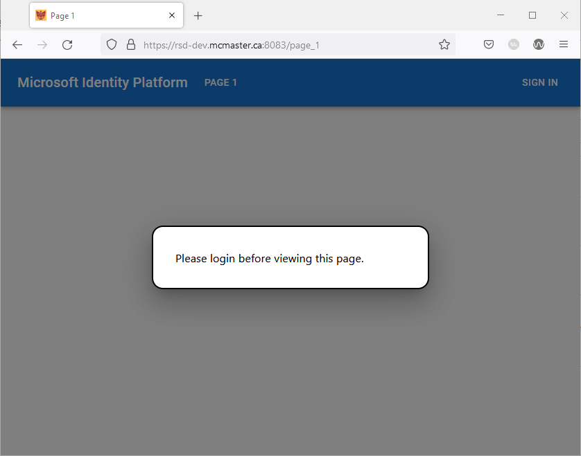

# Testing the SSO Demo SPA

Our demo application is now complete, so we can test signing in using our MacID credentials.

### Run a production instance of the SPA
Create a production instance of the demo SPA using the following commad:
```
docker-compose --file docker-compose.production.yaml -p auth-demo-prod up --build
```

#### Calling the API from the application
1. Open your browser of choice and navigate to the fully qualified domain name of your server.
2. Select the **SIGN IN** button. For the purposes of this tutorial, choose the **Sign in using Popup** option.


3. After the popup window appears with the sign-in options, select the account with which to sign-in.
4. A second window may appear instructing to use multi-factor authentication before logging in.
5. For **Stay signed in**, you can select either **No** or **Yes** depending on your preferences.
6. The app might ask for permission to sign-in and access data. Select **Accept** to if presented with a "Permissions requested" prompt.


7. The SPA will now display a button saying **Request Profile Information**. Click it to display the Microsoft Graph profile data acquired from the Microsoft Graph API.


8. To sign out, click the **SIGN OUT** button and select **Sign out using Popup**. Select the account that you want to sign out of. You will redirected to the index page when the sign out process is complete.


9. Click on **Page 1** in the navigation bar. You will not be allowed to view the content of this page since you are not logged in.



10. Click anywhere outside the `Modal` box to initiate the login process.
11. After successfully logging in, you will be redirected to "Page 1" and you will now be able to view its content.


12. Sign out and then try logging back in using the redirect flow.